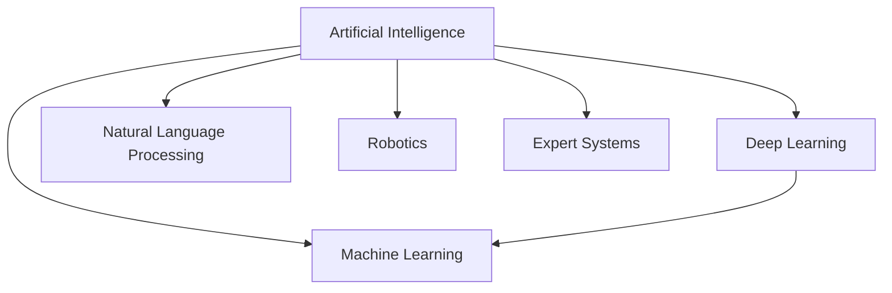
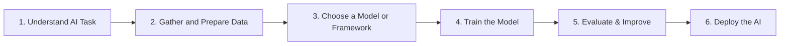
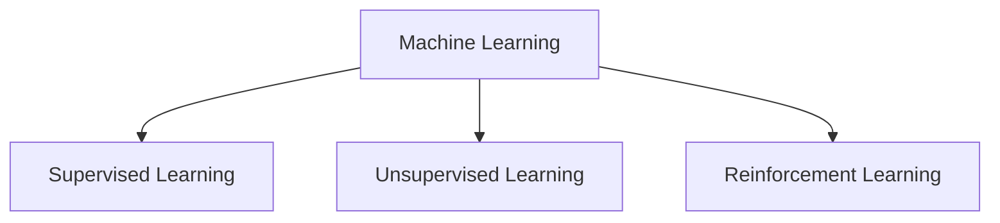

# LECTURE 1 - Introduction to Artificial Intelligence

**Module:** IT2011 - Artificial Intelligence and Machine Learning  
**Lecturer:** Dr. Lakmini Abeywardhana  
**Academic Year:** Year 02, Semester 01  
**Institution:** Sri Lanka Institute of Information Technology (SLIIT)  
**Faculty:** Faculty of Computing

---

## Outline

- Traditional programming vs Artificial Intelligence (AI) and Machine Learning (ML)
- Difference between Artificial Intelligence (AI) and Machine Learning (ML)
- Branches of Artificial Intelligence (AI)
- Branches of Machine Learning (ML)

---

## Foundations and Evolution of Artificial Intelligence

### ENIAC (1946): The Beginning of the Digital Era

- The **Electronic Numerical Integrator and Computer (ENIAC)** was the first general-purpose electronic digital computer, developed in the United States during World War II.
- Though not AI itself, ENIAC paved the way for programmable machines by showing that machines could be built to perform complex computations.
- It marked the starting point for computational thinking, which is foundational for AI.

---

### 1956 Dartmouth Workshop: The Birth of AI

**Organized by:**
- John McCarthy
- Marvin Minsky
- Nathaniel Rochester
- Claude Shannon

**Key Points:**
- This historic workshop formally introduced the term **"Artificial Intelligence"**.
- **Objective:** "To find how to make a machine that can simulate every aspect of learning or any other feature of intelligence."
- Considered the official birth of the AI field.
- Sparked early research in problem-solving, logic, and symbolic reasoning (symbols: words, objects, variables).

---

### 1956 Dartmouth Conference: The Founding Fathers of AI

The key figures who attended:
1. John McCarthy
2. Marvin Minsky
3. Claude Shannon
4. Ray Solomonoff
5. Alan Newell
6. Herbert Simon
7. Arthur Samuel
8. Oliver Selfridge
9. Nathaniel Rochester
10. Trenchard More

---

## AI Milestones Across Decades

### 1960-1970s: Symbolic AI & Expert Systems
- Early AI focused on rule-based systems that used logic to mimic human reasoning.
- **Example:** ELIZA, an early natural language processor.

### 1980s: Rise of Expert Systems
- Expert Systems mimicked decision-making of human experts.
- **Examples:** 
  - MYCIN (medical diagnosis)
  - DENDRAL (chemical analysis)
- Used knowledge bases and inference engines.

### 1990s: Machine Learning Emerges
- Shift from rule-based to data-driven learning
- Decision Trees, k-NN, and SVMs gained popularity.
- AI systems started adapting to data rather than relying solely on logic.

### 2010s: Deep Learning Breakthroughs
- With massive data and computation power, deep neural networks achieved human-level performance in image recognition, speech processing, and more.
- **Key technologies:** CNNs, RNNs, and Reinforcement Learning.
- **Notable moment:** AlphaGo beating the world Go champion in 2016.

### 2020s: Generative AI Revolution
- Generative AI models like GPT, DALL-E, and Stable Diffusion emerged.
- These models generate text, images, music, and even code.
- Built on Transformer architecture and massive language modeling datasets.
- Widely used in creative, educational, and productivity applications.

---

## Core Branches of AI



The main branches include:
1. **Machine Learning**
2. **Deep Learning**
3. **Natural Language Processing (NLP)**
4. **Robotics**
5. **Expert Systems**

---

## Traditional Programming vs AI/ML

### Traditional Programming (Rule-Based Systems)

**How It Works:**
- A programmer explicitly writes rules to process data.
- The logic is hand-coded: every condition and action must be predefined.
- The system operates strictly based on what has been coded.

**Formula:**
```
Input + Human-Written Rules → Output
```

**Flow:**
```
Data → Computer Program (Rules) → Output (Report Card)
```

**Example:**
If you're writing a program to classify whether a number is even or odd:

```python
if number % 2 == 0:
    print("Even")
else:
    print("Odd")
```

The rule is directly embedded in the code by the human.

---

### Traditional Programming: Characteristics

| Feature | Traditional Programming |
|---------|------------------------|
| **Logic Source** | Written by human developers |
| **Flexibility** | Low – must update code to change behavior |
| **Predictability** | High – same input always gives same output |
| **Learning Capability** | None – does not improve with data |

---

## AI/ML-Based Systems

**How It Works:**
- The machine is given examples of inputs and correct outputs.
- It learns patterns or rules from the data using algorithms (e.g., decision trees, neural networks).
- The logic is not explicitly coded — it is inferred from data.

**Formula:**
```
Input + Output Data → Learn Rules → Model
```

**Example:**
In spam email classification:
- **Input:** Email content
- **Output:** "Spam" or "Not Spam"
- The model learns from hundreds/thousands of labeled examples to classify new emails.

---

### AI/ML-Based Systems: Characteristics

| Feature | AI/ML-Based Programming |
|---------|------------------------|
| **Logic Source** | Learned from data using algorithms |
| **Flexibility** | High – adapts to new patterns in data |
| **Predictability** | Moderate – may vary depending on training |
| **Learning Capability** | Yes – improves with more data and feedback |

---

## Key Shift in Programming Paradigm

The fundamental difference:
- **Traditional:** Humans define the rules
- **AI/ML:** Machines learn the rules from data

---

## AI Model Development Process



1. **Understand AI Task:** Determine the type of AI task and metrics
2. **Gather and Prepare Data:** Collect and preprocess relevant datasets
3. **Choose a Model or Framework:** Select appropriate tools or frameworks
4. **Train the Model:** Split data and train the model
5. **Evaluate & Improve:** Assess model performance and make improvements
6. **Deploy the AI:** Deploy the model using suitable platforms

---

## AI vs ML vs DL vs Generative AI

### Visual Hierarchy

```
┌─────────────────────────────────────────────┐
│         Artificial Intelligence (AI)        │
│  ┌───────────────────────────────────────┐  │
│  │      Machine Learning (ML)            │  │
│  │  ┌─────────────────────────────────┐  │  │
│  │  │   Deep Learning (DL)            │  │  │
│  │  │  ┌───────────────────────────┐  │  │  │
│  │  │  │  Generative AI            │  │  │  │
│  │  │  └───────────────────────────┘  │  │  │
│  │  └─────────────────────────────────┘  │  │
│  └───────────────────────────────────────┘  │
└─────────────────────────────────────────────┘
```

---

### 1. Artificial Intelligence (AI)

**Definition:**
Artificial Intelligence is a broad field of computer science focused on building systems that can simulate human intelligence.

**Capabilities of AI include:**
- Reasoning
- Learning
- Perception (e.g., vision, hearing)
- Language understanding
- Problem-solving
- Decision-making

**Examples:**
- Chess-playing programs
- Voice assistants (e.g., Siri, Alexa)
- Self-driving cars
- Facial recognition systems

**Note:** AI is the umbrella term under which Machine Learning, Deep Learning, and Generative AI fall.

---

### 2. Machine Learning (ML)

**Definition:**
Machine Learning is a subset of AI that enables computers to learn from data and improve their performance without being explicitly programmed for each task.

**Key Idea:**
Rather than being told how to perform a task (as in traditional programming), the system learns patterns and rules from examples.

**Types of ML:**
- **Supervised Learning** (labeled data)
- **Unsupervised Learning** (unlabeled data)
- **Reinforcement Learning** (learning via rewards)

**Examples:**
- Email spam filters
- Fraud detection in banking
- Recommendation systems (Netflix, YouTube)

---

### 3. Deep Learning (DL)

**Definition:**
Deep Learning is a subset of Machine Learning that uses multi-layered neural networks to learn from data.

**Key Characteristics:**
- Can automatically extract features from raw data
- Works well with large and complex datasets
- Mimics the human brain's layered structure

**Popular Architectures:**
- **CNN (Convolutional Neural Networks):** Image processing
- **RNN (Recurrent Neural Networks):** Sequence data (e.g., text, time series)
- **Transformers:** Used in language models (e.g., GPT)

**Examples:**
- Face recognition on smartphones
- Voice assistants understanding spoken commands
- Self-driving cars interpreting surroundings

---

### 4. Generative AI (GenAI)

**Definition:**
Generative AI is a specialized area of AI that focuses on creating new content such as text, images, music, and code using learned patterns from data.

**Key Technologies:**
- **Transformer Models** (e.g., GPT-4, Gemini)
- **GANs** (Generative Adversarial Networks)
- **Diffusion Models** (used in image generation like DALL·E, Midjourney)

**Use Cases:**
- Writing essays, summaries, code
- Creating artwork, illustrations, animations
- Enhancing and colorizing old photos
- Designing new products or music

**Examples of Tools:**
- ChatGPT (text generation)
- DALL·E (image generation)
- DeepArt, Artbreeder (AI art)
- GitHub Copilot (code generation)

---

## Summary Comparison Table

| Concept | Category | Function | Examples |
|---------|----------|----------|----------|
| **AI** | Broadest scope | Simulate human intelligence | Siri, Self-driving cars |
| **ML** | Subfield of AI | Learn from data | Spam filters, Recommendations |
| **DL** | Subfield of ML | Learn from large data via neural nets | Face recognition, Voice AI |
| **Generative AI** | Subfield of DL/AI | Create new, original content | ChatGPT, DALL·E, Bard |

---

## Detailed Hierarchy Description

### Artificial Intelligence (AI)
**Description:** AI involves techniques that equip computers to emulate human behavior, enabling them to learn, make decisions, recognize patterns, and solve complex problems in a manner akin to human intelligence.

### Machine Learning (ML)
**Description:** ML is a subset of AI, uses advanced algorithms to detect patterns in large data sets, allowing machines to learn and adapt. ML algorithms use supervised or unsupervised learning methods.

### Deep Learning (DL)
**Description:** DL is a subset of ML which uses neural networks for in-depth data processing and analytical tasks. DL leverages multiple layers of artificial neural networks to extract high-level features from raw input data, simulating the way human brains perceive and understand the world.

### Generative AI
**Description:** Generative AI is a subset of DL models that generates content like text, images, or code based on provided input. Trained on vast data sets, these models detect patterns and create outputs without explicit instruction, using a mix of supervised and unsupervised learning.

---

## Types of Machine Learning



---

### 1. Supervised Learning

**Definition:**
The algorithm learns from a labeled dataset, where each training example is paired with the correct output.

**Goal:**
To predict outputs for new, unseen data.

**Common Tasks:**
- **Classification:** Predict categories (e.g., spam or not spam)
- **Regression:** Predict numerical values (e.g., house price)

**Examples:**
- Email spam detection (spam/ham)
- Credit scoring (good/bad risk)
- Stock price prediction

**Analogy:**
Like learning with an answer key.

---

### 2. Unsupervised Learning

**Definition:**
The algorithm works on unlabeled data and tries to find hidden patterns or structures without explicit instructions.

**Goal:**
To discover groupings, associations, or patterns in data.

**Common Techniques:**
- **Clustering:** Group similar data points (e.g., customer segmentation)
- **Dimensionality Reduction:** Reduce number of input variables (e.g., PCA)

**Examples:**
- Grouping customers based on buying behavior
- Recommending products using similarity
- Anomaly detection in cybersecurity

**Analogy:**
Like exploring a puzzle with no hints.

---

### 3. Reinforcement Learning

**Definition:**
The model learns by interacting with an environment and receiving rewards or penalties.

**Goal:**
To take actions that maximize cumulative rewards over time.

**Key Concepts:**
- **Agent:** Learner or decision-maker
- **Environment:** The world it interacts with
- **Reward:** Feedback from the environment
- **Policy:** Strategy used to determine next action

**Examples:**
- Game AI (e.g., AlphaGo, Dota 2 bots)
- Robotics (e.g., walking, grasping)
- Traffic signal optimization

**Analogy:**
Like learning to ride a bike through trial and error.

---

## Deep Learning Models

Deep Learning is a subfield of Machine Learning that uses artificial neural networks with multiple layers to learn abstract representations from large amounts of data.

**Below are the most widely used deep learning architectures and their use cases:**

1. Convolutional Neural Networks (CNNs)
2. Recurrent Neural Networks (RNNs)
3. Transformers

---

### 1. Convolutional Neural Networks (CNNs)

**Purpose:** Primarily used for image processing and computer vision tasks

**How It Works:**
- CNNs apply filters (kernels) over input images to detect patterns like edges, shapes, and textures.
- These features are then used to identify objects or classify images.

**Key Features:**
- **Convolutional Layers:** Extract spatial features
- **Pooling Layers:** Reduce dimensionality and overfitting
- **Fully Connected Layers:** Perform final classification

**Examples:**
- Handwritten digit recognition (MNIST)
- Face detection and recognition
- Medical image analysis

---

### 2. Recurrent Neural Networks (RNNs)

**Purpose:** Designed for sequential data, such as text, speech, time series, and sensor signals.

**How It Works:**
- RNNs maintain a memory of previous inputs via loops in the architecture.
- They can make predictions based on current input and previous context.

**Variants:**
- **LSTM (Long Short-Term Memory)** – solves the vanishing gradient problem
- **GRU (Gated Recurrent Unit)** – simplified version of LSTM

**Examples:**
- Language modeling and sentence generation
- Speech-to-text transcription
- Predicting stock prices or weather

---

### 3. Transformers

**Purpose:** State-of-the-art models for natural language processing (NLP) and more recently vision tasks.

**Key Innovation:**
- **Self-attention mechanism:** Allows the model to focus on different parts of the input simultaneously.

**Why Important?**
- Unlike RNNs, Transformers process all tokens in parallel → faster and scalable.
- Foundation of modern large language models (LLMs) like:
  - GPT (Generative Pre-trained Transformer)
  - BERT (Bidirectional Encoder Representations from Transformers)
  - T5, Gemini, Claude, LLaMA

**Examples:**
- ChatGPT (text generation)
- Google Translate (language translation)
- Document summarization and question answering

---

## Generative AI

### What is Generative AI?

Generative AI is a type of Artificial Intelligence that can **CREATE new things**.

It doesn't just recognize or classify — it can actually produce content.

---

### What Can It Create?

**Text** – Writes essays, emails, poems, or even books.
- **Example:** ChatGPT generating a story.

**Images** – Draws faces, animals, logos, posters.
- **Example:** DALL·E creating a cat with sunglasses.

**Music** – Composes melodies or background tunes.

**Code** – Helps write programs or debug code.
- **Example:** GitHub Copilot completing Python code.

---

### Tools That Use Generative AI:

- **ChatGPT** – For writing and conversation
- **DALL·E, Midjourney** – For image generation
- **GitHub Copilot** – For programming support

---

### Real-Life Uses of Generative AI:

- Designing social media posts or marketing visuals
- Helping students summarize or draft essays
- Making new logos, clothes, or product designs
- Writing stories, poems, or even jokes for fun

---

## Generative Models: GANs & Diffusion Models

### A. GANs – Generative Adversarial Networks

**Structure:**
Consist of two neural networks:
- **Generator:** Creates fake data
- **Discriminator:** Detects real vs fake

**How They Work:**
- They compete, improving each other over time.
- GANs can generate photorealistic images, deepfakes, and art.

**Examples:**
- Artbreeder (face generation)
- Deepfake video creation
- AI-generated clothing designs

---

### B. Diffusion Models

**How They Work:**
- Work by adding noise to data and then learning to reverse that noise.
- Capable of producing ultra-high-quality images and art.

**Popular Models:**
- DALL·E 2
- Midjourney
- Stable Diffusion

---

## Prompt Engineering

### What is a Prompt?

A **prompt** is the message or question you give to an AI tool like ChatGPT or DALL·E.

**Prompt Engineering** is the skill of writing clear and effective prompts to get useful results.

---

### Why is it Important?

- The quality of the output depends on the quality of your prompt.
- **A better prompt = smarter, more accurate, more creative results.**

---

### Tips for Writing Great Prompts:

1. **Be clear and specific**
2. **Mention the style, tone, or format you want**
3. **Add examples if needed**

---

## References

1. [Artificial Intelligence Model Types - Virtualization Team](https://virtualizationteam.com/artificial-intelligence-ai/artificial-intelligence-model-types.html)

---

**End of Lecture 1**

---

**Notes:**
- Total Pages: 49
- Date: 2025-10-23
- Student: IT24103352
