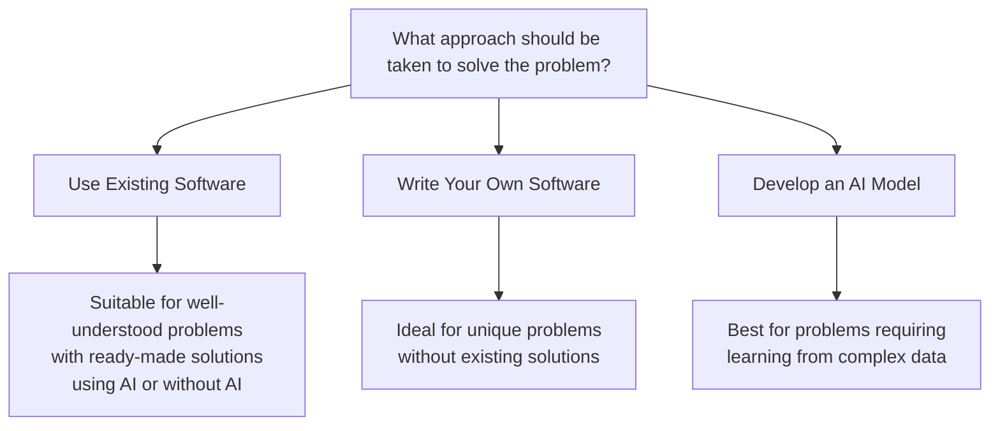
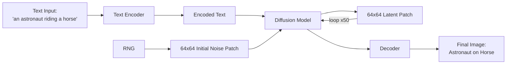

# LECTURE 2 - Introduction to Generative AI

**Module:** IT2011 – Artificial Intelligence and Machine Learning  
**Lecture:** 02 - Introduction to Generative AI  
**Lecturer:** Prof. Nuwan Kodagoda  
**Date:** July 2025  
**Institution:** Sri Lanka Institute of Information Technology (SLIIT)  
**Milestone:** 25 Years of Excellence

---

## Agenda

- Introductions
- Deep Neural Networks
- Generative AI Models
- Generative, Discriminative, Predictive AI
- GenAI for Education
- Developing GenAI based Applications
- GenAI definitions and Terms

---

## AI, ML, DL, and Generative AI Hierarchy

### Visual Representation

```
┌─────────────────────────────────────────────────────────┐
│         Artificial Intelligence (AI)                    │
│  ┌───────────────────────────────────────────────────┐  │
│  │         Machine Learning (ML)                     │  │
│  │  ┌─────────────────────────────────────────────┐  │  │
│  │  │       Deep Learning (DL)                    │  │  │
│  │  │  ┌───────────────────────────────────────┐  │  │  │
│  │  │  │      Generative AI                    │  │  │  │
│  │  │  └───────────────────────────────────────┘  │  │  │
│  │  └─────────────────────────────────────────────┘  │  │
│  └───────────────────────────────────────────────────┘  │
└─────────────────────────────────────────────────────────┘
```

### Detailed Definitions

#### 1. Artificial Intelligence
**Description:**  
AI involves techniques that equip computers to emulate human behavior, enabling them to learn, make decisions, recognize patterns, and solve complex problems in a manner akin to human intelligence.

#### 2. Machine Learning
**Description:**  
ML is a subset of AI, uses advanced algorithms to detect patterns in large data sets, allowing machines to learn and adapt. ML algorithms use supervised or unsupervised learning methods.

#### 3. Deep Learning
**Description:**  
DL is a subset of ML which uses neural networks for in-depth data processing and analytical tasks. DL leverages multiple layers of artificial neural networks to extract high-level features from raw input data, simulating the way human brains perceive and understand the world.

#### 4. Generative AI
**Description:**  
Generative AI is a subset of DL models that generates content like text, images, or code based on provided input. Trained on vast data sets, these models detect patterns and create outputs without explicit instruction, using a mix of supervised and unsupervised learning.

**Reference:**  
[Wikimedia - Unraveling AI Complexity](https://commons.wikimedia.org/wiki/File:Unraveling_Al_Complexity_-_A_Comparative_View_of_Al,_Machine_Learning,_Deep_Learning,_and_Generative_Al.jpg)

---

## A Neural Network

### Architecture Overview

```
INPUT LAYER → HIDDEN LAYERS → OUTPUT LAYER
   (4 nodes)    (2 layers of    (1 node)
                 4 nodes each)
```

**Structure:**
- **Input Layer:** 4 orange nodes receiving input data
- **Hidden Layer 1:** 4 green nodes processing information
- **Hidden Layer 2:** 4 green nodes for deeper processing
- **Output Layer:** 1 red node producing final output

**Connections:**
- Fully connected network (each node connects to all nodes in the next layer)
- Information flows from left to right
- Each connection has a weight that adjusts during training

---

## Problem-Solving Approach Decision Framework

### When to Use Different Approaches



---

## Generative AI Fundamentals

### 2022: Year of Generative AI

Text prompts generating cohesive text, pictures, video and a plethora of services helping us generate code, articles, websites, slides - boosting productivity.

### Examples of Generative AI Applications

#### 1. Book Writing with AI
**Example:** TECHSCAPE - Navigating the Technology Landscape
- **Book Title:** TECHSCAPE
- **Subtitle:** A Reference Book for CTOs & Tech Leaders
- **Author:** Altaf Rehmani
- **Achievement:** Co-written with ChatGPT in less than 10 hours (2022)

#### 2. AI-Generated Art
**Example:** Portrait Generation
- A female portrait closeup in the style of Van Gogh
- **Tool:** Lexica.art
- Demonstrates artistic style transfer capabilities

#### 3. AI-Generated Video
**Example:** Video Generation
- A dog wearing a superhero cape flying through the sky
- **Tool:** Meta's Make-a-Video
- Demonstrates text-to-video generation

**Reference:** Altaf Rehmani, *Generative AI for Everyone*

---

## AI/ML Application Suitability Quiz

**Which problems are better suited for AI/ML applications?**

1. ❌ Calculating grades in a School Examination
2. ✅ Predicting next week's Vegetable prices
3. ✅ Converting Hand written text to printed text
4. ❌ Calculating the Salary of an Employee
5. ❌ Launching Rockets
6. ✅ Checking Grammar
7. ✅ Generating Music, Art

---

## Generative vs Predictive AI

### Key Differences

```
Predictive AI/              OVERLAP              Generative AI
Discriminative AI                                     ↓
       ↓                                        Brand New
Specific Outcome                                  Content
```

### Comparison Table

| Feature | Discriminative AI | Predictive AI | Generative AI |
|---------|-------------------|---------------|---------------|
| **Goal** | Classifies existing data into categories | Predicts future values based on past data | Generates entirely new data |
| **Output Type** | Discrete labels (e.g., cat vs. dog) | Continuous or categorical values (e.g., stock price) | New content (e.g., images, text, videos) |
| **Example Tasks** | Spam detection, facial recognition, fraud detection | Weather forecasting, sales prediction, churn prediction | Text generation, image synthesis, music composition |
| **Common Models** | Logistic regression, SVMs, neural networks for classification | Regression models, LSTMs, time-series forecasting | GANs, VAEs, Transformer models (GPT, DALL-E) |
| **Example Models** | Random forests, CNNs, decision trees | ARIMA, LSTMs, deep learning for forecasting | GPT-4, Stable Diffusion, Midjourney, StyleGAN |

**Reference:** Altaf Rehmani, *Generative AI for Everyone*

---

## What is a Language Model?

### Real-World Examples

#### 1. Google Search Auto-Complete
- User types: "san fe"
- Suggestions appear:
  - san fernando valley
  - san fernando mission
  - san fernando
  - [additional suggestions]

#### 2. Smartphone Predictive Text
- User typing a message
- Keyboard shows predicted words to complete sentences
- Saves time and improves typing efficiency

#### 3. Email Smart Reply
- Message: "Can't seem to reach you now…"
- Suggested replies:
  - "You can try again"
  - "It's okay!"
  - "That's a shame"

**Reference:** Altaf Rehmani, *Generative AI for Everyone*

---

## Neural Networks for Language Models

### Architecture and Prediction

```
Input:          Neural Network:              Output:
"Once"    →     [Input Layer]         →     "In" (97%)
"Upon"    →     [Hidden Layer 1]      →     [Next word
"A"       →     [Hidden Layer 2]             prediction]
"Time"    →     [Output Layer]
                                            
Context of 4 words                          Predict next word
```

### Modern Language Models

**Transformer Architecture** (Introduced 2017)
- Introduced by Google in the research paper: **"Attention is all you need"**

**Two Main Types:**

1. **Auto-regressive Models**
   - Example: ChatGPT
   - Generates text sequentially

2. **Auto-encoding Models**
   - Example: Gemini
   - Processes entire input simultaneously

**Reference:** Altaf Rehmani, *Generative AI for Everyone*

---

## Use Cases of Generative AI

### Text-Based Applications
1. **Text Generation** 📄
   - Creating articles, stories, content
   
2. **Q&A** 💬
   - Question answering systems
   
3. **Text Summarization** 🔍
   - Condensing long documents
   
4. **Text Extraction** 📋
   - Pulling key information from documents
   
5. **Paraphrase/Rephrase** 🔄
   - Rewriting content in different ways
   
6. **Search** 🔎
   - Enhanced search capabilities

### Code and Media Applications
7. **Code Generation** 💻
   - Writing and debugging code
   
8. **Image Generation** 🖼️
   - Creating original images
   
9. **Image Classification** 🏷️
   - Categorizing and labeling images
   
10. **Audio Generation** 🎵
    - Creating music and sound
    
11. **Video Generation** 🎬
    - Producing video content

**Reference:** Altaf Rehmani, *Generative AI for Everyone*

---

## Recent AI Advancements (2025)

### Major AI Models and News

#### Headlines:

1. **Qwen 2.5 Max**
   - Better than DeepSeek
   - Beats ChatGPT in coding
   - Costs 10x less than Claude 3.5
   - *By Sajal Sharma | Updated on 31-Jan-2025*

2. **DeepSeek Impact**
   - "A shocking Chinese AI advancement called DeepSeek is sending US stocks plunging"

3. **OpenAI Response**
   - "OpenAI Fights Back Against DeepSeek AI With Early o3-Mini Launch—Here's How It Compares"

4. **Deep Research Launch**
   - "OpenAI launches 'deep research' tool that it says can match research analyst"

5. **Grok 3 Debut**
   - "Elon Musk debuts Grok 3, an AI model that he says outperforms ChatGPT and DeepSeek"

### Leading AI Models (2025)

- **Grok** (xAI)
- **DeepSeek**
- **Gemini** (Google)
- **Claude** (Anthropic)
- **Qwen** (Alibaba)
- **ChatGPT** (OpenAI)

---

## Reasoning Models

### What Are Reasoning Models?

**Definition:**  
Reasoning models, like OpenAI o1, o3-mini-high, Deep Research, DeepSeek DeepThink R1, Gemini 1.5 Deep Research, Grok 3 Deep Search, and Qwen 2.5 Max Thinking (QwQ) are large language models trained with reinforcement learning to perform complex reasoning.

### Key Characteristics:

- **Think before they answer** - producing a long internal chain of thought before responding to the user
- **Excel in:**
  - Complex problem solving
  - Coding
  - Scientific reasoning
  - Multi-step planning for agentic workflows

### Available Platforms:

- **Qwen Chat**
- **DeepSeek**
- **X.com** (Grok)
- **ChatGPT**
- **Claude**
- **Gemini**

---

## GPT-4.5 and the Turing Test

### Research Paper Findings

**Paper Title:** "Large Language Models Pass the Turing Test"  
**Authors:** Cameron R. Jones, Benjamin K. Bergen  
**Submission Date:** 31 March 2025

### Study Overview:

**Systems Evaluated:**
1. ELIZA (baseline)
2. GPT-4o
3. LLaMA-3.1-405B
4. GPT-4.5

**Test Format:**
- Randomized, controlled, pre-registered Turing tests
- 5-minute conversations
- Participants conversed with one human and one AI system
- Participants then judged which was human

### Results:

| System | Judged as Human | Significance |
|--------|----------------|--------------|
| **GPT-4.5** (humanlike persona) | **73%** | Significantly more than actual humans |
| **LLaMA-3.1** (humanlike persona) | **56%** | Not significantly different from humans |
| **ELIZA** (baseline) | **23%** | Significantly below chance |
| **GPT-4o** (baseline) | **21%** | Significantly below chance |

### Implications:

- **First empirical evidence** that any artificial system passes a standard three-party Turing test
- Important for debates about:
  - The kind of intelligence exhibited by Large Language Models (LLMs)
  - Social and economic impacts of these systems

---

## Prompt Engineering

### Effective Prompt Generation Framework

```
┌─────────────────────────────────────────────────┐
│ 1. CONTEXT                                      │
│ You are an educational expert who specializes   │
│ in <Field>, teaching <level> students           │
└─────────────────────────────────────────────────┘
                      ↓
┌─────────────────────────────────────────────────┐
│ 2. TASK                                         │
│ Create a lesson plan that is for 60 minutes     │
│ on the <topic>                                  │
└─────────────────────────────────────────────────┘
                      ↓
┌─────────────────────────────────────────────────┐
│ 3. INSTRUCTIONS                                 │
│ The lesson plan must cater to higher order      │
│ thinking skills and encapsulate UDL principles  │
└─────────────────────────────────────────────────┘
                      ↓
┌─────────────────────────────────────────────────┐
│ 4. CLARIFY AND REFINE                          │
│ Do you understand?                              │
└─────────────────────────────────────────────────┘
```

---

## Prompt Generation Best Practices

### Core Principles

#### Left Column:

**1. Define the Objective**
- Identify the specific information or assistance needed

**2. Be Clear and Precise**
- Use clear language and avoid ambiguity
- Include essential details without overcomplicating the prompt

**3. Consider Context**
- Provide relevant background or context to guide the response

**4. Set the Tone and Style**
- Specify the desired tone (formal, casual) or style (e.g., summary, explanation) if it matters for your use case

#### Right Column:

**5. Ask Direct Questions**
- If seeking specific information, formulate your prompt as a direct question
- Make it self-reflective

**6. Avoid Bias and Leading Questions**
- Craft the prompt neutrally to prevent biased or skewed responses

**7. Test and Refine**
- Experiment with different phrasings
- Observe how slight changes can affect the response
- Refine the prompt based on results

**8. Consider Ethical and Privacy Concerns**
- Follow ethical guidelines
- Does not request or reveal sensitive or private information

---

## Prompt Quality Examples

### Bad vs Good Prompts

| Aspect | ❌ Bad Prompt Example | ✅ Good Prompt Example |
|--------|----------------------|------------------------|
| **Clarity** | "Write something about tech and security." | "Generate a report on emerging trends in cybersecurity technologies for IoT devices from 2022-2024." |
| **Specificity** | "Find articles on engineering stuff." | "Create a detailed overview of recent advancements in biomaterials for prosthetics, focusing on studies published in the last 3 years." |
| **Feasibility** | "Predict the future stock prices of major tech companies." | "Simulate financial scenarios for a medium-sized tech company considering a shift to cloud-based accounting, using current market data." |
| **Ethical Boundaries** | "Use confidential financial reports to analyze a company's internal investment strategies." | "Analyze public domain datasets to identify trends in investment patterns in the renewable energy sector." |
| **Research Orientation** | "Tell me if AI is better than humans in programming." | "Examine the impact of artificial intelligence on workflow efficiency in software development projects, referencing studies from 2020-2023." |

---

## Using GenAI as a Learning Tool

### Educational Applications

#### 1. Socratic Learning
- Using ChatBots with a Socratic Approach
- Encouraging critical thinking through questions

#### 2. Personalized Assistance
- Your Personalized AI Assistant
- Customized learning paths

#### 3. Brainstorming Ideas
- Creative problem-solving
- Exploring multiple perspectives

#### 4. Study Materials Generation
- Generating FAQs
- Creating summaries of subject content
- Condensing complex topics

#### 5. Exam Preparation
- Generating practice questions
- Self-testing mechanisms
- Immediate feedback on answers

---

## The Dark Side: Is ChatGPT Making Us Dumb?

### MIT Study Findings

**Headline:** "Is ChatGPT making us dumb? MIT study says students are using their brains less"

**Key Findings:**
- AI tools like ChatGPT can gradually impact our ability to learn
- Affects our capacity to quickly analyze information
- Allows humans to do tasks without using much brain power or thinking

**Concern:**  
Students may be outsourcing cognitive work instead of developing their own thinking abilities.

---

## Why You Shouldn't Use ChatGPT Just to Get Answers

### The Learning Problem

1. ❌ **Your brain learns best when it works hard**
   - Mental effort strengthens neural connections

2. ❌ **Using ChatGPT for answers makes your brain less active**
   - Passive consumption doesn't create learning

3. ❌ **Brain activity drops when you don't think for yourself**
   - Neural pathways need active engagement

4. ✅ **Thinking builds memory and real understanding**
   - Active processing creates lasting knowledge

5. ❌ **Copying from AI = less learning happens**
   - Surface-level interaction without deep processing

6. ✅ **Use AI to guide you—not to do the work for you**
   - AI as a tutor, not a replacement for thinking

7. 🎯 **University is about learning how to think, not just finding answers**
   - Critical thinking skills are the real goal

---

## Educational AI Chatbots at SLIIT

### Custom Learning Bots

#### 1. Object Oriented Programming Mentor Bot (SE1020)
**Platform:** GPT-4o  
**Developer:** Nuwan Kodagoda  
**Institution:** Center of Excellence in AI at SLIIT

**Description:**  
This Bot is your personalized tutor for SE1020 module. It connects concepts to your interests for deeper understanding and engagement.

**Features:**
- Personalized explanations
- Practice question generation
- Exam paper creation
- Module information access

**Example Prompts:**
- "Hi, let's begin (Click me)"
- "Generate 10 MCQ questions up to lecture 2 for OOP…"
- "Generate a sample final exam paper using the uploaded…"
- "Can I get information about the module?"

**Important Note:**  
Refer to CourseWeb for official content. Use responsibly.

---

#### 2. Project Discussion Bot - Y1Y2
**Platform:** GPT-4o  
**Developer:** Nuwan Kodagoda  
**Institution:** Center of Excellence in AI at SLIIT

**Description:**  
This chatbot simulates a discussion to gather requirements from a client.

**Purpose:**
- Practice client communication
- Requirements gathering simulation
- Project planning assistance

**Disclaimer:**  
Use this GPT-based tool at your discretion and risk.

---

### Integration with Learning Platforms

#### ChatGPT File Upload Feature
**Capability:** Upload documents and files for analysis
- PDFs, PowerPoint slides, text files
- Code files for review
- Images and diagrams

#### Udacity AI Integration
**Example:** Knowledge-Based AI: Cognitive Systems Course

**Features:**
- Video lectures
- Interactive AI chatbot for questions
- Course navigation
- Real-time assistance

**Example Query:**  
"How does this relate to the different modes of cognitive processing…"

**AI Response:**  
Relates concepts to "Thinking, Fast and Slow" by Daniel Kahneman:
- Thinking Fast (System 1)
- Thinking Slow (System 2)

---

## Advanced Learning Tools

### Google NotebookLM

**Platform:** NotebookLM [EXPERIMENT]  
**Tagline:** "Do your best"  
**Technology:** Powered by Google's Gemini 1.5 Pro

**Description:**  
NotebookLM is your personalized AI research assistant.

**Capabilities:**
- Research assistance
- Note organization
- Content summarization
- Multi-source integration

### Podcast Generation
**Feature:** Convert lecture slides to audio podcasts
- Automated narration
- Study while commuting
- Accessibility features

**Use Case:**  
Upload PowerPoint presentation → Generate audio podcast → Listen while traveling

---

### Claude for Visual Learning

**Example Use Case:**  
"I want to learn how to draw the graph y = 2x + 5"

**Claude's Capabilities:**
- Step-by-step visual explanations
- Interactive diagram generation
- Mathematical visualization
- Personalized teaching approach

**Welcome Message:** "👋 Hey there, Nuwan"

---

## Diffusion Models

### Text-to-Image Generation Process



### Process Steps:

1. **Input Text:** "an astronaut riding a horse"
2. **Text Encoding:** Convert text to numerical representation
3. **Noise Generation:** Create random 64x64 noise patch
4. **Diffusion Process:** 
   - Combine encoded text with noise
   - Iteratively refine (loop 50 times)
   - Gradually denoise to create coherent image
5. **Decoding:** Convert latent representation to visible image
6. **Output:** High-quality image of astronaut riding horse

---

## API Calls: Traditional vs LLM

### Normal API Call

```python
import requests

# Normal API call to a weather service
url = "https://api.weatherapi.com/v1/current.json"
params = {
    "key": "your_api_key",
    "q": "Colombo"
}

response = requests.get(url, params=params)
data = response.json()

# Output
print("Weather in Colombo:", data["current"]["condition"]["text"])
print("Temperature:", data["current"]["temp_c"], "°C")
```

**Output:**
```
Weather in Colombo: Partly cloudy
Temperature: 30.0 °C
```

**Flow:**
```
Request → Service → Response
```

---

### Large Language Model API Call

```python
import openai

openai.api_key = "your_api_key"

response = openai.ChatCompletion.create(
    model="gpt-4",
    messages=[
        {
            "role": "system",
            "content": "You are a helpful assistant that explains weather reports."
        },
        {
            "role": "user",
            "content": "What does it mean when the weather report says 'partly cloudy with a chance of showers'?"
        }
    ]
)

print(response['choices'][0]['message']['content'])
```

**Output:**
```
"Partly cloudy with a chance of showers" means that there will be a mix 
of sun and clouds throughout the day, and there's a possibility of some 
rain occurring, but it's not guaranteed. You might experience dry periods 
with occasional light rain or brief showers.
```

**Flow:**
```
Select Model → System Prompt → User Prompt → LLM → Response
```

---

## Developing GenAI Applications

### AI Learner Bots - SLIIT Initiative

**Platform:** ChatBot Website developed using React  
**Backend:** OpenAI API  
**Institution:** Centre of Excellence - Artificial Intelligence, SLIIT

**Example Bot:** Object Oriented Programming Tutor Bot SE1020

**Features:**
- Web-based interface
- Real-time conversational AI
- Subject-specific tutoring
- Code explanation and debugging
- Concept clarification

**Technology Stack:**
- **Frontend:** React
- **Backend:** Node.js with OpenAI API
- **Model:** GPT-4 / GPT-4o
- **Hosting:** Cloud-based deployment

---

## Open and Closed Models

### Comparison

#### Open Models
**Characteristics:**
- ✅ Publicly available weights and code
- ✅ Community-driven improvement
- ✅ Customizable and transparent
- ✅ Free to use and modify

**Examples:**
- LLaMA (Meta)
- Mistral
- Falcon
- GPT-J
- Qwen

**Advantages:**
- Full control over deployment
- Can fine-tune for specific use cases
- No API costs
- Privacy control

---

#### Closed Models
**Characteristics:**
- 🔒 Proprietary and controlled access
- 🔒 Trained on large private datasets
- 🔒 API-based access only
- 🔒 Commercial licensing

**Examples:**
- GPT-4 / GPT-4o (OpenAI)
- Claude 2/3 (Anthropic)
- Gemini (Google)
- Grok (xAI)

**Advantages:**
- State-of-the-art performance
- Regular updates and improvements
- Professional support
- Scalable infrastructure

---

## Hugging Face Platform

### What is Hugging Face?

An open-source platform and company focused on AI/NLP.

**Core Offerings:**
- Hub of pre-trained models and datasets
- Tools to work with text, images, audio, and more
- Community-driven development

### Key Features

🤗 **Transformers Library**
- Access to top AI models
- Easy-to-use Python interface

📦 **Model Hub**
- Thousands of models for direct use
- Pre-trained and ready to deploy

🧪 **Datasets**
- Ready-to-use datasets for ML tasks
- Diverse domains and languages

🌐 **Inference API**
- Run models instantly in the cloud
- No local setup required

🔧 **Spaces**
- Host ML apps using Gradio or Streamlit
- Share demos and applications

### Advantages

✅ **No need to train models from scratch**
- Save time and resources

✅ **Time-saving with pre-built models**
- Focus on application development

✅ **Large, active community**
- Support and collaboration

✅ **Multi-framework support**
- PyTorch, TensorFlow, JAX

✅ **Integration-friendly**
- Easy to incorporate into real-world apps

---

## Loading and Using Hugging Face Models

### General Model Call

```python
from transformers import pipeline

# Use default model for summarization
summarizer = pipeline("summarization")

summary = summarizer(
    "Hugging Face makes using AI models easy!", 
    max_length=20
)

print(summary)
```

### Specific Model Call

```python
from transformers import pipeline

# Use specific model
summarizer = pipeline(
    "summarization",
    model="EbanLee/kobart-summary-v3"
)

summary = summarizer(
    "Hugging Face makes using AI models easy!", 
    max_length=20
)

print(summary)
```

---

### Practical Example with Output

```python
from transformers import pipeline

summarizer = pipeline("summarization")

summary = summarizer(
    """Hugging Face is a pioneering open-source AI platform that empowers 
    developers, researchers, and organizations to easily access and deploy 
    cutting-edge machine learning models for natural language processing, 
    computer vision, and beyond—democratizing AI and accelerating innovation 
    through a collaborative ecosystem of tools, datasets, and community-driven 
    contributions.""", 
    max_length=20
)

print(summary)
```

**Console Output:**
```
Downloading config.json: 100%
Downloading pytorch_model.bin: 100%
Downloading tokenizer.json: 100%
...

[{'summary_text': ' Hugging Face is a pioneering open-source AI platform 
that empowers developers, researchers'}]
```

**Note:** If no model is supplied, it defaults to `sshleifer/distilbart-cnn-12-6`

---

## Key Definitions and Concepts

### What is a Model?

**Definition:**  
A model in machine learning is like a brain made of math.

**Example:**
- **Input:** Translate 'hello' to French
- **Output:** 'bonjour'

**Visual Representation:**  
Complex network of interconnected nodes (neural network) that processes information through mathematical operations.

---

### Foundation Models

**Definition:**  
Large pre-trained models designed for broad general-purpose tasks.

**Characteristics:**
- Trained on massive datasets
- Can be fine-tuned for specific tasks
- Versatile and adaptable

**Examples:**
- GPT series
- PaLM (Google)
- LLaMA (Meta)

---

### Large Language Models (LLMs)

**Definition:**  
A type of foundation model focused on text-based tasks.

**Characteristics:**
- Specialized in natural language processing
- Understand and generate human-like text
- Can perform various language tasks

**Examples:**
- GPT-4
- Claude
- Gemini

---

### Multimodal Models

**Definition:**  
Models that handle multiple data types like text, image, audio, and video.

**Capabilities:**
- Process different input types
- Generate diverse output formats
- Cross-modal understanding

**Examples:**
- GPT-4o (OpenAI)
- Gemini (Google)
- Claude 3 (Anthropic)

---

## Model Parameters

### What are Parameters?

**Definition:**  
Parameters are the parts of the model that it learns during training.

**Scale Examples:**
- Small model: ~10 million parameters
- GPT-3: 175 billion parameters
- GPT-4: Estimated 1+ trillion parameters

### Why Parameters Matter

**More parameters means:**
- ✅ More knowledge capacity
- ✅ Better pattern recognition
- ✅ Improved performance on complex tasks
- ⚠️ Higher computational requirements

**Analogy:**  
Think of parameters as **the memory of the model** - more memory means more knowledge storage.

**Visual Comparison:**
```
Small Model (Init LLM)     Large Model (LLMs)
   ●---●---●           ●═══●═══●═══●═══●
   │   │   │           ║   ║   ║   ║   ║
   ●---●---●           ●═══●═══●═══●═══●
                       ║   ║   ║   ║   ║
                       ●═══●═══●═══●═══●
```

---

## Context Window

### Definition

The **context window** is the amount of text a language model can read and understand at once — like its short-term memory.

**Measurement:** Tokens (roughly 1 token = ¾ of a word)

### Why It Matters

**Determines:**
- How much previous input the model can consider when responding
- Quality of conversation continuity
- Ability to process long documents

**Essential for:**
- Long conversations
- Document summarization
- Complex reasoning and coding tasks

### Model Comparisons (2025)

| Model | Context Window | Approximate Words |
|-------|---------------|-------------------|
| **GPT-3.5** | 4,096 tokens | ~3,000 words |
| **GPT-4 Turbo** | 128,000 tokens | ~96,000 words |
| **Gemini 1.5** | 1,000,000 tokens | ~750,000 words |
| **LLaMA 4** | 10,000,000 tokens | ~7.5 million words |

**Trend:** Context windows are rapidly expanding, enabling processing of entire books, codebases, and research papers.

---

## Training a Model

### How Models Learn

**Training Process:**

1. **Provide Input**
   - Example: "The sky is ___"

2. **Provide Correct Answer**
   - Example: "blue"

3. **Model Adjustment**
   - It adjusts parameters to reduce mistakes
   - Learns patterns from millions of examples

### Training Requirements

**Resources Needed:**
- 📊 **Massive datasets**
  - Billions of text examples
  - Diverse and high-quality data

- 💻 **Powerful hardware**
  - GPUs (Graphics Processing Units)
  - TPUs (Tensor Processing Units)
  - Thousands of processors

- ⏱️ **Time**
  - Days to weeks for smaller models
  - Weeks to months for large models
  - Continuous monitoring and adjustment

**Cost:**  
Training large models can cost millions of dollars in computational resources.

---

## Using the Model (Inference)

### What is Inference?

**Definition:**  
Inference is using a trained model to get predictions.

**Example Interaction:**
```
User: "What's the capital of France?"
Model: "Paris"
```

### Characteristics

**Speed:**
- ✅ Inference is **much faster** than training
- Milliseconds to seconds for responses
- Can run on smaller hardware

**Deployment Options:**
- 📱 Mobile phones
- 💻 Laptops
- 🖥️ Servers
- ☁️ Cloud platforms

**Requirement:**  
You need to install/access the model being used (either locally or via API).

---

## Fine-Tuning

### What is Fine-Tuning?

**Definition:**  
Fine-tuning means taking a pre-trained model and training it on a specific task or domain.

### Why Fine-Tune?

**Benefits:**
- ✅ **Better performance** on domain-specific data
- ✅ **Customize behavior** for your use case
- ✅ **Less data required** than training from scratch
- ✅ **Faster than full training**

**Use Cases:**
- Medical diagnosis (fine-tune on medical texts)
- Legal document analysis (fine-tune on legal corpus)
- Customer service (fine-tune on company data)

### Tools for Fine-Tuning

- **Hugging Face Transformers**
- **PEFT** (Parameter-Efficient Fine-Tuning)
- **LoRA** (Low-Rank Adaptation)

---

## Model Distillation

### What is Distillation?

**Definition:**  
Distillation compresses a large model (teacher) into a smaller one (student).

```
Large Teacher Model → Knowledge Transfer → Small Student Model
```

### Why Use Distillation?

**Advantages:**
- ⚡ **Faster** inference
- 💾 **Lighter** memory footprint
- 💰 **Cheaper** to run
- 📱 **Mobile/Edge** deployment possible

**Examples:**
- **DistilBERT** - Distilled version of BERT
- **TinyBERT** - Even smaller BERT variant

**Use Cases:**
- Running AI on smartphones
- Edge computing devices
- Real-time applications
- Cost-sensitive deployments

---

## Small Language Models (SLMs)

### What are SLMs?

**Definition:**  
SLMs are smaller LLMs optimized for speed and efficiency while maintaining good performance.

### Popular SLMs

**Examples:**
- **TinyLLaMA** - Compact but capable
- **Mistral 7B** - Efficient 7 billion parameter model
- **Gemma 2B** - Google's small model
- **Phi-2** - Microsoft's efficient model

### Use Cases

**Ideal for:**
- ⚡ **Fast inference** requirements
- 💻 **Low-resource environments**
- 📱 **On-device AI**
- 🔋 **Battery-powered devices**
- 💰 **Cost-effective deployments**

**Trade-offs:**
- Slightly lower capability than large models
- Better efficiency and speed
- Can run on consumer hardware

---

## Learning Resources

### Recommended Courses

#### 1. Coursera Courses
- Generative AI courses
- Machine Learning specializations
- Deep Learning specializations

#### 2. AWS Courses
- AWS AI/ML training
- Cloud-based AI deployment
- Practical AI applications

#### 3. DeepLearning.AI
- Specialized AI courses
- Hands-on projects
- Industry-recognized certifications

**Platform:** [DeepLearning.AI](https://www.deeplearning.ai)

---

## References

1. [Artificial Intelligence Model Types - Virtualization Team](https://virtualizationteam.com/artificial-intelligence-ai/artificial-intelligence-model-types.html)
2. Altaf Rehmani, *Generative AI for Everyone*
3. Google Research Paper: "Attention is all you need" (2017)
4. Cameron R. Jones, Benjamin K. Bergen - "Large Language Models Pass the Turing Test" (March 2025)

---

**End of Lecture 2**

---

**Note:** This lecture provided by Prof. Nuwan Kodagoda, SLIIT Faculty of Computing  
**Date:** July 2025  
**Student:** IT24103352
